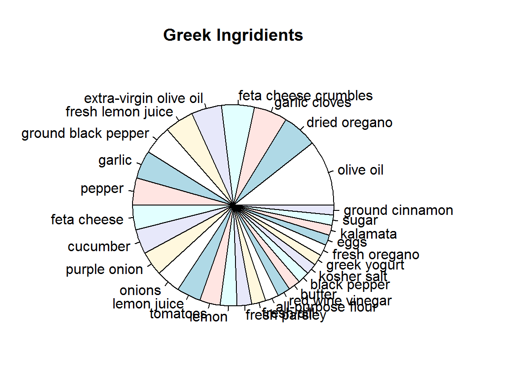
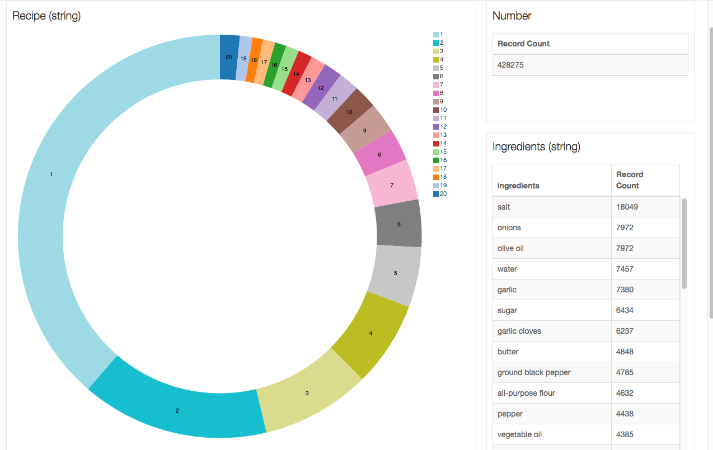
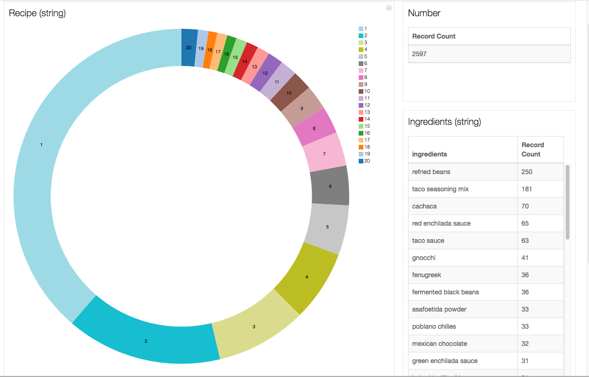
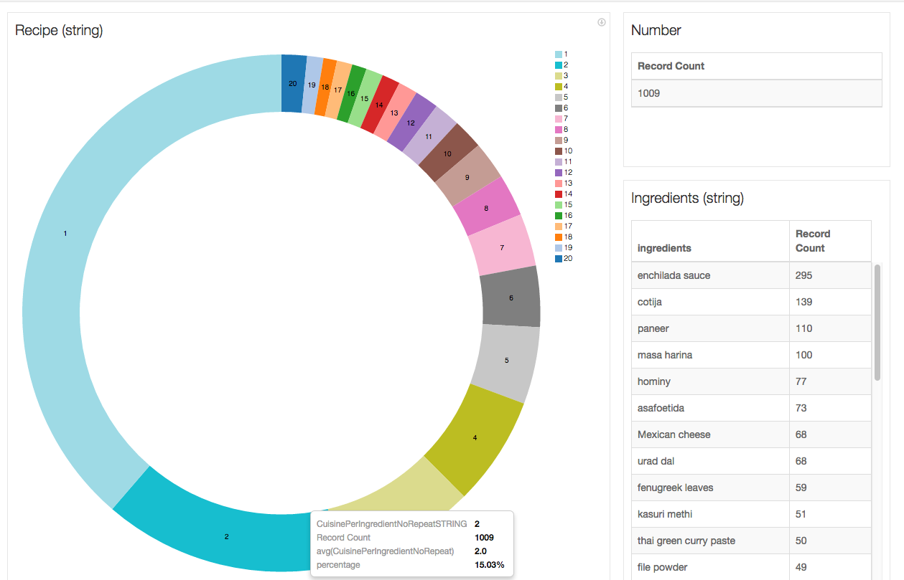
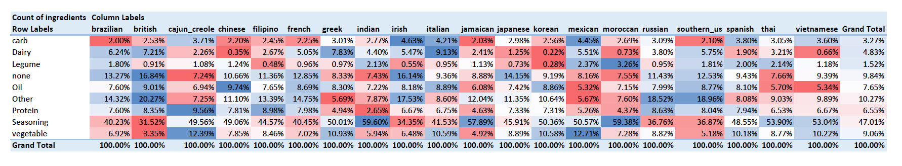
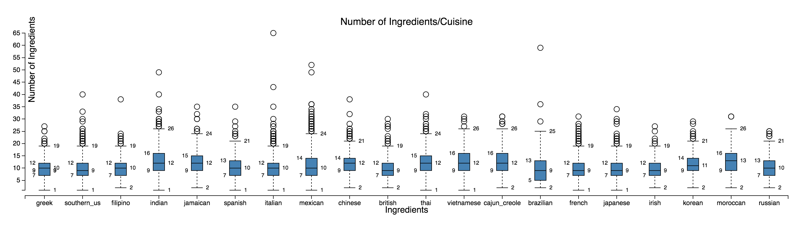
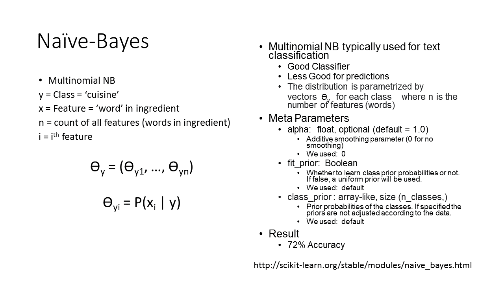

# [What's Cooking](https://www.kaggle.com/c/whats-cooking)

## **Week 1**: Intro (Start 5/5)
### Summary Data

#### Total Recipes: 39774

|	# of cuisines	|	20	|
|---		|---		|
|	'italian'	|	7838	|
|	'mexican'	|	6438	|
|	'southern_us'	|	4320	|
|	'indian'	|	3003	|
|	'chinese'	|	2673	|
|	'french'	|	2646	|
|	'cajun_creole'	|	1546	|
|	'thai'	|	1539	|
|	'japanese'	|	1423	|
|	'greek'	|	1175	|
|	'spanish'	|	989	|
|	'korean'	|	830	|
|	'vietnamese'	|	825	|
|	'moroccan'	|	821	|
|	'british'	|	804	|
|	'filipino'	|	755	|
|	'irish'	|	667	|
|	'jamaican'	|	526	|
|	'russian'	|	489	|
|	'brazilian'	|	467	|

#### Total Ingredients: 428275

|	# of ingredients	|	6714	|
|---		|---	 	|
|	'salt'	|	 18049	|
|	'olive oil'	|	 7972	|
|	'onions'	|	 7972	|
|	'water'	|	 7457	|
|	'garlic'	|	 7380	|
|	'sugar'	|	 6434	|
|	'garlic cloves'	|	 6237	|
|	'butter'	|	 4848	|
|	'ground black pepper'	|	 4785	|
|	'all-purpose flour'	|	 4632	|
|	'pepper'	|	 4438	|
|	'vegetable oil'	|	 4385	|
|	'eggs'	|	 3388	|
|	'soy sauce'	|	 3296	|
|	'kosher salt'	|	 3113	|
|	'green onions'	|	 3078	|
|	'tomatoes'	|	 3058	|
|	'large eggs'	|	 2948	|
|	'carrots'	|	 2814	|
|	'unsalted butter'	|	 2782	|
|	'extra-virgin olive oil'	|	 2747	|
|	'ground cumin'	|	 2747	|
|	'black pepper'	|	 2627	|
|	'milk'	|	 2263	|
|	'chili powder'	|	 2036	|
|	'oil'	|	 1970	|
|	'red bell pepper'	|	 1939	|
|	'purple onion'	|	 1896	|
|	'scallions'	|	1891	|

### Ingredients by Cuisine
[Full set of Pie Charts](piecharts.html)

### Number of Cuisines per Ingredient
[Full set of Pictures](sherry/SummaryPics)

### Distribution of Categorized Ingredients

### Appendix
We graphed each cuisine and the number of ingredients used in each of their recipes in hopes that would be a differentiator. However
* the cuisines were very similar.

## **Week 2**: Discover 3 Features (Start 5/12)
### NB with TFID

* Consistently around 63-65% accuracy ([Full set results for trial/error](sherry/data/results.csv))
* Steps:
    * Create bag of words (or ingredient phrases in this case) for train dataset
    * Calculate tfidf for each ingredient and cuisine
    * Use MultinomialNB model, with tfidf and accompanying cuisines, to match up recipes
    * Predict based on cuisine with highest probability, calculated by summing cuisine probability for ingredient with probabilities higher than 0.4
* Higher accuracy when:
    * Each recipe was a single "document"
    * full ingredients were used rather than ingredient words
    * cleaned for accents and lowercased
    * common/meaningless modifiers removed
    * hypens/parentheticals removed
    * low alpha in NB model
    * using MultinomialNB versus BernoulliNB
    * Use probability of 0.4 as cut-off point for when an ingredient is used for classifying
    * Used sum of quadratic probabilities (weight higher probabilities higher)
* TODO:
    * Figure out probabilities where classification should be done with another model
    * Figure out which cuisines are frequently confused
    * Perhaps combine with ingredient-type and words

## **Week 3**: Find 2 Models (Start 5/19)

## **Week 4**: Submit 1 Kaggle (Start 6/2)
